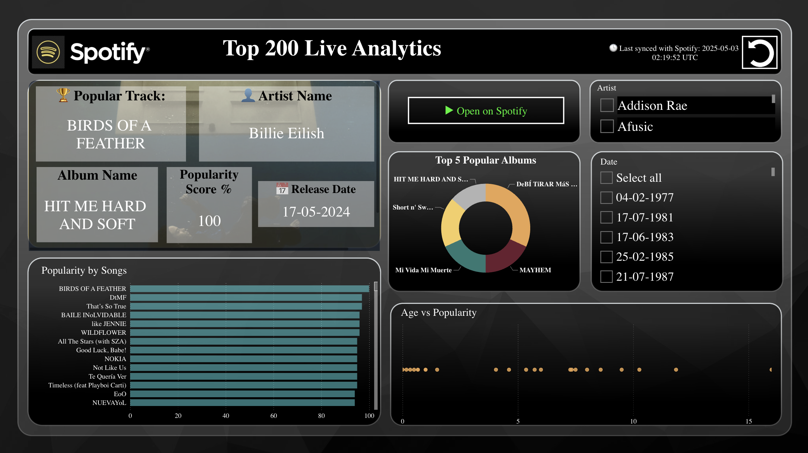

# 🎧 Spotify Live Top 200 Dashboard — Power BI Data Intelligence Platform

This project automatically retrieves and updates the **Spotify Global Top 200 Playlist** every day at **7:00 AM UTC**, using the Spotify Web API and a Python script. The dataset is used to power a **live Power BI dashboard** that showcases streaming trends, top tracks, and artist insights.

---

## 📌 Key Features

- ✅ Automated data refresh via [GitHub Actions](https://github.com/features/actions)
- ✅ Live data pull from the [Spotify API](https://developer.spotify.com/documentation/web-api/)
- ✅ Artist photo enrichment using artist ID lookups
- ✅ Clean CSV output ready for Power BI dashboards
- ✅ Power BI integration via public raw CSV URL

---

## 🛠 Technologies Used

| Tool        | Purpose                        |
|-------------|--------------------------------|
| Python      | API access, data transformation|
| Pandas      | Data cleaning & formatting     |
| GitHub Actions | Cloud automation scheduler  |
| Power BI    | Data visualization             |

---

## 🗂 Files

| File                          | Description                          |
|-------------------------------|--------------------------------------|
| `refresh_spotify_data.py`     | Main Python script to fetch and save the data |
| `spotify_playlist_data.csv`   | Auto-generated CSV (updated daily)   |
| `.github/workflows/refresh.yml` | GitHub Actions workflow file       |

---

## 📊 Dashboard Features (Power BI)

The Power BI dashboard includes:

- Top track cards: Name, artist, album, popularity, release date
- Artist spotlight with photos
- Popularity distribution by track
- New tracks released over time
- Dynamic slicers (artist, date)
- Heatmaps and unit charts (using Deneb)

---

## ⚙️ Automation Schedule

- The workflow runs daily at **7:00 AM UTC**
- Output CSV is committed to this repo: [`spotify_playlist_data.csv`](spotify_playlist_data.csv)
- Can be connected to Power BI using the **raw GitHub CSV URL**

---

## 🔗 How to Use in Power BI

1. In Power BI Desktop → **Get Data → Web**
2. Paste this URL: https://raw.githubusercontent.com/AmjadKudsi/spotify-live-refresh/main/spotify_playlist_data.csv
3. Transform and model your data
4. Add slicers, KPIs, charts as needed

---

## 📬 Contact

Built by **Amjad Ali**  
🧑‍💻 *Data Science Student | Quant Analytics *  
🔗 LinkedIn: [LinkedIn Profile](https://www.linkedin.com/in/amjadkudsi/) 

---

## 📄 License

This project is for educational use. Spotify data © Spotify.

